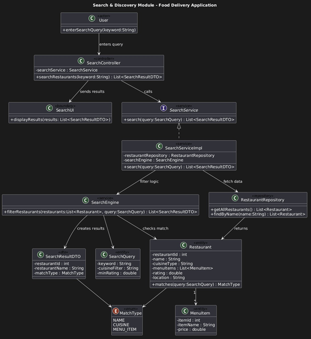
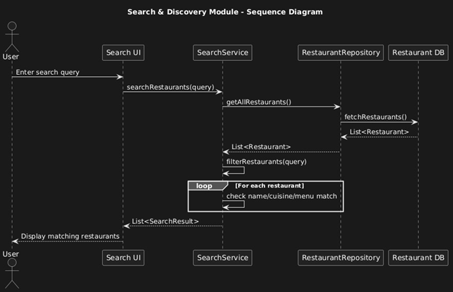

# OOAD Mini Project – Search and Discovery Module

## 📌 Module Name
**Search and Discovery Module – Food Delivery Application**

---

## 🎯 Objective
The Search and Discovery module enables users to easily find restaurants and food items available on the platform. It allows searching using keywords such as restaurant name, cuisine type, or food item.

This module improves user experience by allowing quick discovery of relevant restaurants without manually browsing all options.

---

## 📝 Description
In a food delivery system, users must quickly locate restaurants or food items that match their preferences.

### 🔄 Working Flow
1. User enters a search keyword (e.g., "pizza")
2. `SearchService` receives the query
3. System checks restaurant data
4. Matching restaurants are identified
5. Results are returned as `SearchResult` objects containing:
   - Restaurant ID  
   - Restaurant Name  
   - Matching Criteria (name / cuisine / item)

---

## ⚙️ Responsibilities
- Process user search queries  
- Find matching restaurants  
- Return formatted search results  
- Support keyword-based discovery  

---

## 🧩 Key Components
- **SearchService (Interface)** – Defines search functionality  
- **SearchServiceImpl** – Implements search logic  
- **SearchResult** – Represents search output  
- **RestaurantRepository** – Provides restaurant data  
- **Restaurant** – Restaurant entity  

---

## 📊 Expected Output
A list of restaurants matching the user's search query.

**Example:**
Search Query: "Burger"

Results:

Burger King
Burger Palace
Hot Burger Hub

---

## ✅ Benefits
- Faster restaurant discovery  
- Improved user experience  
- Efficient filtering of restaurants  

---

## 📷 Diagrams

### 🧱 Class Diagram

---

### 🔄 Sequence Diagram
